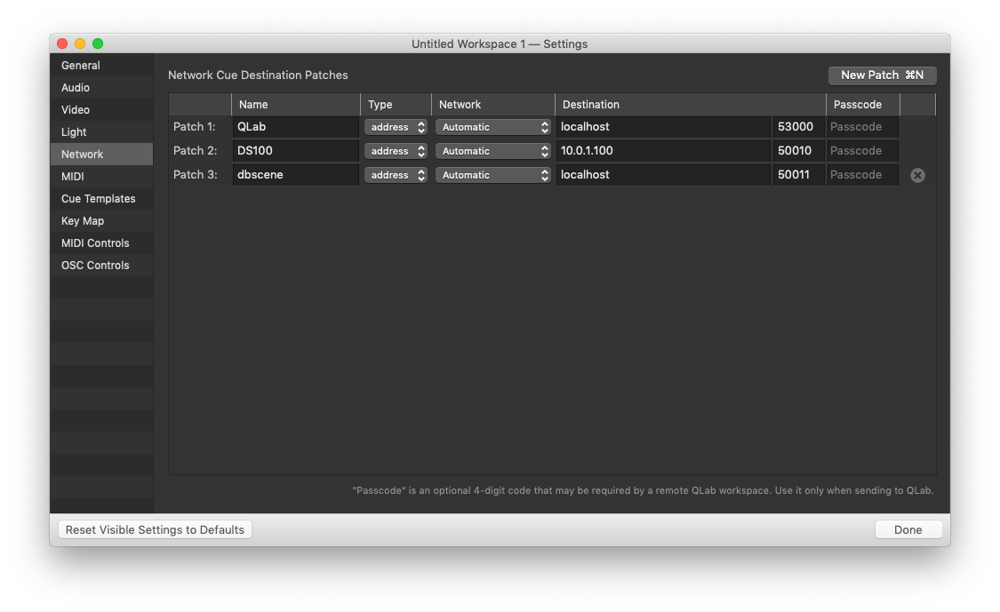

# dbscene

Welcome to dbscene, an Open Sound Control utility for scene store/recall integration between d&amp;b audiotechnik's [DS100](https://www.dbaudio.com/global/en/products/processing-matrix/ds100/) and Figure53's [QLab](https://qlab.app/).

**DISCLAIMER**: This code is not extensively tested. If you're interested in using it but have questions, please do not hesitate to reach out to [samsdomainaddress@gmail.com](mailto:samsdomainaddress@gmail.com) or [submit an issue](https://github.com/samschloegel/node-dbscene/issues) on GitHub.

---

# Installation

```
npm install dbscene
```

If you're interested in trying out this package but do not have a DS100 readily available for testing it, you could try using [fakeds100](https://github.com/samschloegel/fake-DS100), a node app that will reply to Soundscape object position requests for testing purposes.

---

# Initial Setup

After installing, require the package in your code:

```js
const Dbscene = require('dbscene');
```

This will import a class definition.

Create an instance of that class:

```js
const dbscene = new Dbscene(config, cache);
```

`config` and `cache` are required properties. Scroll down for details.

```js
dbscene.startDbServer();
dbscene.startQLabServer();
```

The dbscene instance uses two UDP sockets - one for communication with the DS100 and one for communication with QLab. These two sockets are not bound to their respective listening ports (50011, 53001) upon creation of the Dbscene instance. Call the two methods shown above to begin listening for OSC messages.

```js
dbscene.getAllObjPos();
```

This will request the current position of all Soundscape objects defined dbscene.cache from the DS100.

## Config

Config must be a copy of the following object:

```js
{
  qlab: {
    address: "localhost", // The IP address of your QLab machine
    ds100Patch: 1, // Your patch number
    defaultDuration: 0.2 // Your chosen network cue duration, in seconds
  },
  ds100: {
    address: "10.0.1.100", // Ihe IP address of your DS100
    defaultMapping: 1 // See below
  },
  logging: 0 // 0 - Critical Only; 1 - Some logging; 2 - More logging
}
```

- `qlab.ds100Patch` sets the QLab Network Patch of the DS100.
- `qlab.defaultDuration` sets the length, in seconds, of each new "Network" cue created in QLab. Values greater than 0 can result in OSC messages being sent repeatedly, depending on the resend rate selected in the Network Cue Template for your QLab workspace.
- All object coordinates sent to a DS100 have a "Mapping", for which a default is defined here in `ds100.defaultMapping`. See [d&b documentation](https://www.dbaudio.com/global/en/products/processing-matrix/ds100/#tab-downloads) for more information.
- `logging` can optionally be included, and defaults to `0`. Errors and some basic information will be logged at level 0.

## Cache

```js
{
  1: "Homer",
  2: "Marjorie",
  3: "Bartholomew",
  4: "Lisa"
}
```

Cache should be an object in the format shown above. For each Soundscape object, add a property using the DS100 input number as the key and a string for the value.

The Dbscene constructor converts this cache object into another format - `dbscene.cache` will return an array of objects with x and y coordinates like this:

```js
[
  {
    num: 1,
    name: 'Homer',
    x: 0.0,
    y: 0.0,
  },
];
```

The names entered will be used in the cue names of the resulting QLab cues, so make them something useful, eh?

## QLab Setup



Make sure OSC input and output are active, and make sure the Network tab of Workspace Preferences is properly configured - probably something like the image above. Also make sure "Use OSC Controls" is checked in the OSC Controls tab.

---

# Definitions

For the purposes of this documentation, the terms "dbscene" and "position cue" are defined below.

## dbscenes

A **dbscene** is a QLab Group Cue containing a separate Network Cue for each object to be recalled.

Each dbscene's qname **must** begin with the prefix "dbscene: " (including the colon and space). This prefix will be added to each new dbscene automatically. Please add whatever name you'd like following the "dbscene: " prefix but **do not** remove it or cue update functionality will break.

## Position cues

**Position cues** are the QLab Network Cues within a **dbscene**. Each position cue will automatically be named "{Object #} - {Object name}: {x coordinate}, {y coordinate}". You can manually change the qnames of a position cue as you see fit, but your custom alterations will be overwritten if the /dbscene/update method is called while the cue is selected.

---

# Dbscene Instance Methods

- getCache() - Returns the cache
- startDbServer() - Binds the UDP socket for teh DS100 to its port and listens for OSC messages
- startQLabServer() - See above, same idea
- queryAllObjPos([mapping]) - Refreshes all object positions with current positions from the DS100
- getCacheObj(objNum) - Returns the cache object with the provided number. Throws an error if none is found.
- removeCacheObj(objNum) - Removes an object from the cache
- newCacheObj(objNum, objName) - Adds a new object to the cache, refreshes its current position, returns the new object

---

# OSC Methods

**Before using this package** you should be familiar with the basics of using OSC with QLab. You can find the official documentation [here](https://qlab.app/docs/v4/scripting/osc-dictionary-v4/).

**Before using this package** you should be familiar with the basics of using OSC to control the En-Scene features of d&b's DS100. You can download d&b's OSC implementation guide on [this page](https://www.dbaudio.com/global/en/products/processing-matrix/ds100/#tab-downloads).

## /**dbscene**

### /dbscene/**create**

Creates a new dbscene at the selection point by sending a series of OSC commands to QLab.

### /dbscene/**update**

1. In QLab, select the dbscenes you wish to update. You may select dbscenes themselves, or position cues within them.

1. With the cues selected, send **/dbscene/update** to update the selected cues. The simplest way to do this is likely with a hotkey from within QLab itself.

---

## "That's all, folks"

That's all for now. Hopefully more to come sometime soon.

If you'd like to leave feedback, report a bug, or make a feature request, please [submit an issue](https://github.com/samschloegel/node-dbscene/issues) or [send me an email](mailto:samsdomainaddress@gmail.com).
